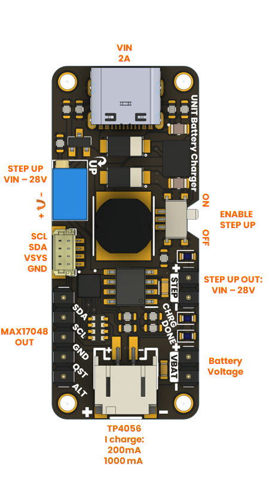

# MAX1704X

El control del circuito integrado MAX1704X mediante Arduino se lleva a cabo a través de la comunicación I2C. En este repositorio, encontrarás ejemplos que ilustran la comunicación, permitiéndote obtener información como el voltaje de la batería, el porcentaje de carga, y el valor de carga o descarga.

## Configuración del entorno

Para configurar el entorno en Arduino IDE, sigue estos pasos:

1. Ve a "Administrar bibliotecas".
   

2. Instala la versión disponible de **Adafruit MAX1704X**.

Descarga el código básico de prueba para la conexión:

    <a href="./Software/MAX17048_basic/MAX17048_basic.ino" download="MAX17048_basic.ino">
        <button style="background-color: #4CAF50; color: white; padding: 10px 20px; border: none; border-radius: 4px; cursor: pointer;">
            MAX17048_basic.ino
        </button>
    </a>

## Conexiones

Recomendamos la conexión a través del conector rápido QWIIC.

## Implementación

Visualiza la lectura de los datos en el Monitor Serie.

<h1>Créditos y Referencias</h1>

<a href="https://github.com/adafruit/Adafruit_MAX1704X/tree/main">Adafruit_MAX1704X</a>
