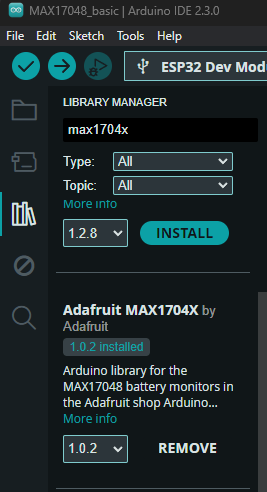

# MAX1704X

El control del circuito integrado MAX1704X mediante Arduino se lleva a cabo a través de la comunicación I2C. En este repositorio, podrás encontrar ejemplos que ilustran la comunicación. En ellos, es posible obtener información como el voltaje de la batería, el porcentaje de carga, y el valor de carga o descarga.

## Configuración del entorno

Para configurar el entorno en Arduino IDE, dirígete a "Administrar bibliotecas":

Instala la versión disponible perteneciente a **Adafruit MAX1704X**.

Descarga el código básico de prueba para la conexión.

## Conexiones

Recomendamos la conexión a través del conector rápido QWIIC.

## Implementación

# Créditos

[Adafruit_MAX1704X](https://github.com/adafruit/Adafruit_MAX1704X/tree/main)

