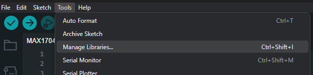
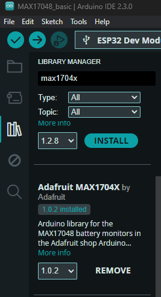
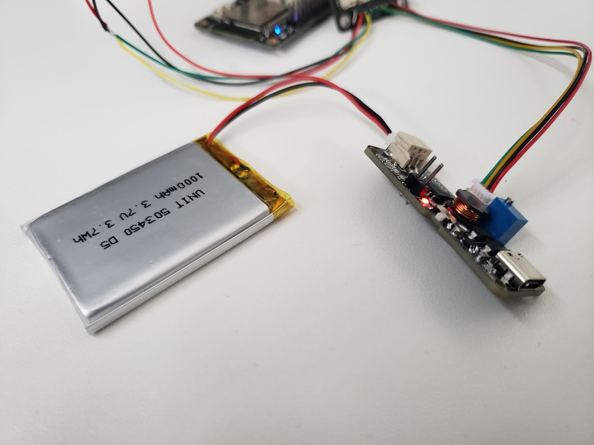
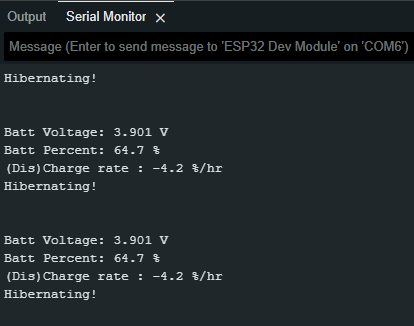

## Usando Arduino

Para configurar el entorno en el Arduino IDE, siga estos pasos:
1. Vaya a "Gestor de bibliotecas".

2. Instale la versión disponible de **Adafruit MAX1704X**.

Descargue el código de prueba básico para la conexión:

    <a href="../../Software/MAX17048_basic/MAX17048_basic.ino" download="MAX17048_basic.ino">
        <button style="background-color: #4CAF50; color: white; padding: 10px 20px; border: none; border-radius: 4px; cursor: pointer;">
            MAX17048_basic.ino
        </button>
    </a>

Se recomienda utilizar la [placa DualMCU]() para utilizar los conectores JTAG con el método QWIIC. El código de implementación es para esta placa, pero puede adaptar el código a otras placas compatibles.

Vea los datos a través del monitor serie.

