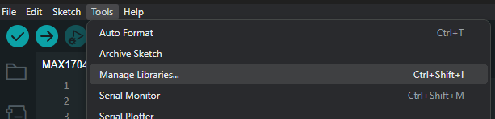

## Using Arduino 

To set up the environment in the Arduino IDE, follow these steps:
1. Go to "Library Manager".
   

2. Install the available version of **Adafruit MAX1704X**.

Download the basic test code for connection:

- [MAX17048_basic.ino](./MAX17048_basic/MAX17048_basic.ino)
- [MAX17048_advanced.ino](./MAX17048_advanced/MAX17048_advanced.ino)

It is recommended to use the [DualMCU board](https://uelectronics.com/producto/unit-dualmcu-esp32-rp2040-tarjeta-de-desarrollo/) for utilizing the JTAG connectors with the QWIIC method. The implementation code is for this board, but you can adapt the code to other compatible boards.

View the data through the serial monitor.

---
⌨️ with ❤️ from [UNIT-Electronics](https://github.com/UNIT-Electronics) 😊