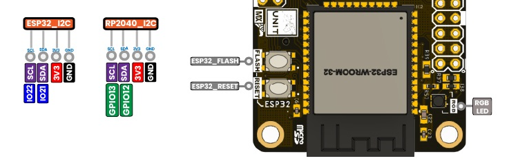

# Usando MicroPython

Este código ha sido probado en el microcontrolador RP2040 de la placa [DualMCU](https://uelectronics.com/producto/unit-dualmcu-esp32-rp2040-tarjeta-de-desarrollo/).

## Método de Uso

Para configurar, descarga la biblioteca y guárdala en el microcontrolador. Cuando uses Thonny, asegúrate de guardarla con el nombre `max1704x.py`.

- [Library](./example/max1704x.py)


El código `Test.py` describe el uso principal y cualquier instrucción especial. Es esencial ejecutar este código en la placa RP2040.

- [Test](./example/Test.py)


Prueba rápida: Copia este código y ejecútalo usando Thonny:

<div align = "center">



</div>

```python
from max1704x import max1704x

mi_sensor = max1704x(sda_pin=12, scl_pin=13)

print("Dirección I2C del sensor:", mi_sensor.address())

mi_sensor.quickStart()
```

Esta versión es adaptable a otras placas, con un enfoque en la implementación cercana.

---
⌨️ con ❤️ por [UNIT-Electronics](https://github.com/UNIT-Electronics) 😊 